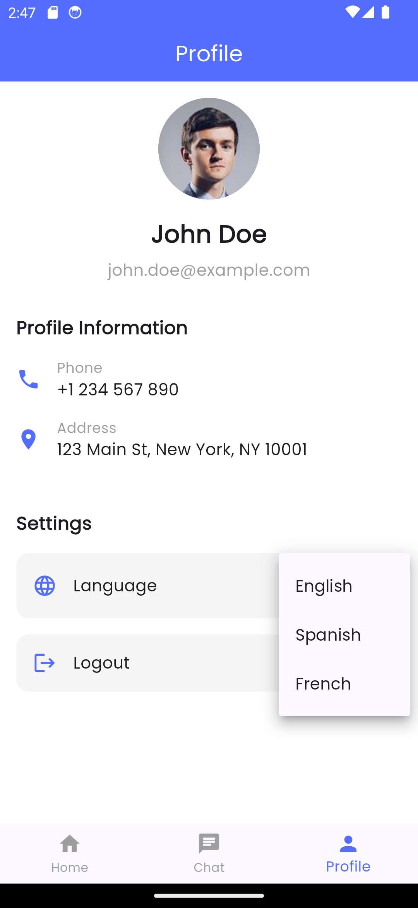

# GetX Multi Language App

A Flutter application demonstrating multi-language support using GetX state management library.



## Features

- **Multi-language Support**: Switch between English, Spanish, and French
- **GetX State Management**: Efficient state management with GetX
- **Clean Architecture**: Well-organized code structure
- **Elegant UI**: Modern and responsive user interface

## Screens

### Dashboard
The main container with bottom navigation to navigate between:
- Home
- Chat
- Profile

### Home Screen
Displays a list of posts with images and descriptions.

### Chat Screen
Shows a list of recent chats with unread message indicators.

### Profile Screen
- User information display
- Language selector dropdown
- Settings options

## Project Structure

```
lib/
├── app/
│   ├── data/
│   │   └── models/           # Data models
│   ├── modules/              # Feature modules
│   │   ├── dashboard/        # Dashboard module (bottom navigation)
│   │   ├── home/             # Home screen module
│   │   ├── chat/             # Chat screen module
│   │   └── profile/          # Profile screen module
│   ├── routes/               # App routes
│   ├── translations/         # Language translations
│   └── utils/                # Utilities (theme, etc.)
└── main.dart                 # Entry point
```

## Implementation Details

### State Management
- Uses GetX for reactive state management
- Implements controller pattern for business logic

### Internationalization
- Supports multiple languages (English, Spanish, French)
- Easy language switching with persistent state

### Navigation
- GetX route management
- Bottom navigation with IndexedStack for state preservation

## Getting Started

1. Clone the repository
2. Run `flutter pub get` to install dependencies
3. Run `flutter run` to start the application

## Dependencies

- [get](https://pub.dev/packages/get): ^4.6.6 - State management, navigation, and dependency injection
- [google_fonts](https://pub.dev/packages/google_fonts): ^6.1.0 - Custom fonts
- [flutter_svg](https://pub.dev/packages/flutter_svg): ^2.0.9 - SVG rendering

## License

This project is licensed under the MIT License - see the LICENSE file for details.
